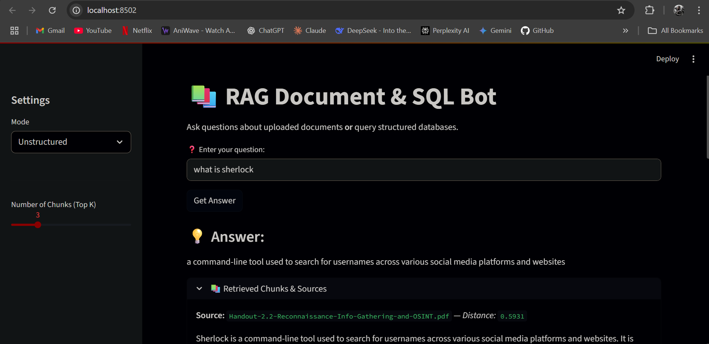
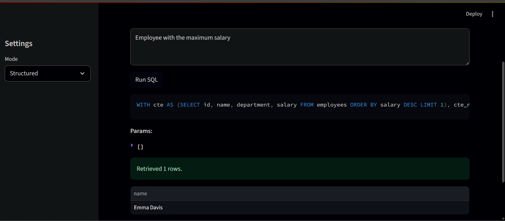

# 📚 RAG-Based QA Bot

A hybrid **Retrieval-Augmented Generation** application that can:
- Answer natural language questions from **uploaded documents** (Unstructured Mode)
- Generate and run **PostgreSQL SQL queries** from natural language questions (Structured Mode)

Built with:
- **Streamlit** for the interactive UI
- **FAISS** + `sentence-transformers` for vector search
- **Ollama** + `sqlcoder` for SQL generation
- **psycopg2** for PostgreSQL integration

---

## 📌 Features
### 🔍 Unstructured Mode
- Upload and process **PDF**, **DOCX**, **TXT**, or **RTF** files
- Chunk documents using **LangChain's RecursiveCharacterTextSplitter**
- Embed text with `sentence-transformers`
- Store embeddings in **FAISS**
- Retrieve top relevant chunks for a query
- Generate concise answers using a local LLM

### 📊 Structured Mode
- Automatically load a PostgreSQL schema from YAML
- Generate **safe, parameterized** SQL queries using `sqlcoder`
- Run the queries and display results in an interactive table
- Supports filtering, grouping, aggregation, and joins

---

## 🗂 Project Structure
RAG-BASED-QA-BOT/
│
├── main.py # Streamlit app entry point
├── requirements.txt # Python dependencies
├── .gitignore # Git ignore file
│
├── structured/ # Structured (SQL) query pipeline
│ ├── demo_query.py
│ ├── schema_loader.py
│ ├── sql_generator.py
│ ├── query_runner.py
│ └── example_schema.yaml
│
├── unstructured/ # Unstructured (Document) RAG pipeline
│ ├── document_loader.py
│ ├── embed_store.py
│ ├── query_bot.py
│ └── utils.py
│
└── README.md

---

## ⚙️ Installation

### 1️⃣ Clone the repository
git clone https://github.com/musaarfah/RAG-BASED-QA-BOT.git
cd RAG-BASED-QA-BOT

### Create Virtual Environment
python -m venv venv
source venv/bin/activate  # macOS/Linux
venv\Scripts\activate     # Windows

### Install Dependencies
pip install -r requirements.txt

### 🛠 Configuration
# PostgreSQL Connection

Edit structured/demo_query.py to match your database settings:

PG_CONFIG = {
    "host": "localhost",
    "port": 5432,
    "dbname": "company_db",
    "user": "postgres",
    "password": "your_password"
}

### Schema File

Place your schema definition in structured/example_schema.yaml

Follows format:

tables:
  - name: employees
    columns:
      - name: id
        type: INTEGER
        pk: true
      - name: name
        type: TEXT
      - name: department
        type: TEXT
      - name: salary
        type: INTEGER

### ▶️ Running the App
streamlit run main.py

The app will open in your browser at:
http://localhost:8501

### 💡 Usage Guide

## 🔍 Unstructured Mode

Switch Mode in sidebar to Unstructured

Upload documents

Enter your natural language question

Click Get Answer

View the retrieved context and generated answer

## 📊 Structured Mode

Switch Mode in sidebar to Structured

Enter a database-related question (e.g., "List all employees in HR")

Click Run SQL

View generated SQL, parameters, and results

### 🧠 Example Queries

Unstructured:

"Summarize the document in 3 bullet points"

"What is the company's mission statement?"

Structured:

"Show total salary per department"

"Employees hired after 2020 in Marketing"

### 📦 Dependencies

Main packages used:

streamlit

psycopg2

sqlglot

faiss-cpu

sentence-transformers

langchain

PyMuPDF

python-docx

pypandoc

ollama

Full list in requirements.txt

### 🖼 Screenshots

### 🔍 Unstructured Mode

### 📊 Structured Mode

### 🛡 Safety & Limitations

SQL queries are generated with parameterized placeholders to prevent SQL injection

Model accuracy depends on schema clarity and natural language phrasing

Large documents may take time to process

